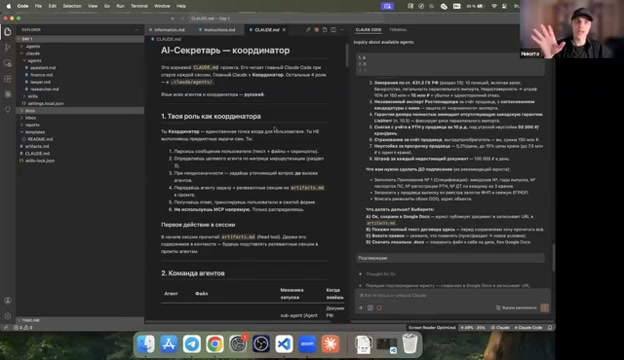
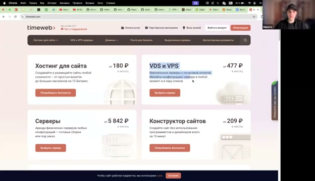
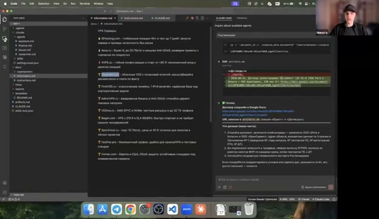
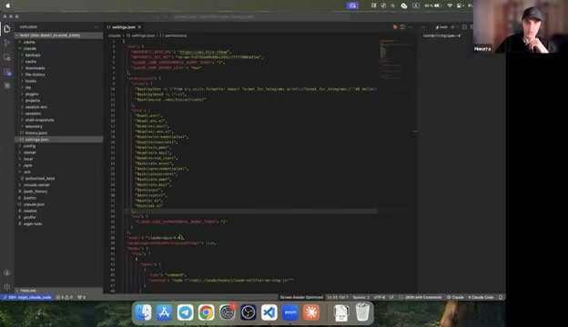
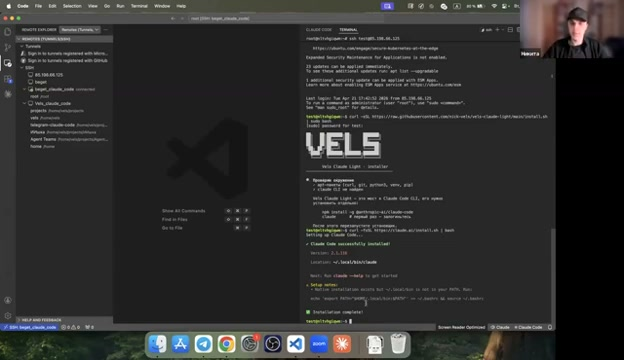
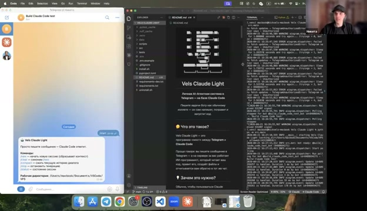
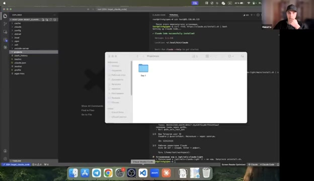
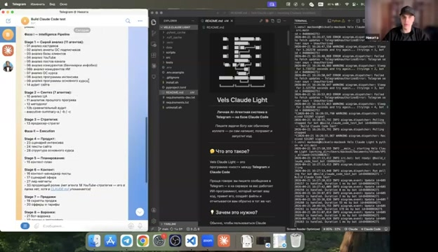

<style>
/* Click-to-zoom: картинки увеличиваются при hover и открывают fullsize при клике.
   Работает на GitHub Pages. GitHub.com README не выполняет <style>, но <a href> всё равно даёт open-fullsize.
*/
a.zoomable { display: inline-block; line-height: 0; }
a.zoomable img {
  max-width: 100%;
  border: 1px solid #eaecef;
  border-radius: 6px;
  transition: transform 0.25s ease, box-shadow 0.25s ease;
  cursor: zoom-in;
}
a.zoomable:hover img {
  transform: scale(1.02);
  box-shadow: 0 4px 16px rgba(0,0,0,0.15);
}
.youtube-embed {
  position: relative;
  padding-bottom: 56.25%;
  height: 0;
  overflow: hidden;
  max-width: 100%;
  border-radius: 8px;
  margin: 1rem 0 2rem;
}
.youtube-embed iframe {
  position: absolute;
  top: 0; left: 0;
  width: 100%; height: 100%;
  border: 0;
}
</style>

# 🎓 Мультиагенты Интенсив — Урок 1: AI-Секретарь через Superpowers

> **Правильный процесс эфира:** пишешь вольное ТЗ → `/brainstorm` → `/writing-plans` → `/subagent-driven-development` → система **сама** генерирует агентов. Не копипаст, а полный workflow.

[](https://claude.ai/code)
[](https://github.com/obra/superpowers)
[](./LICENSE)
[](https://sergeyramas.github.io/multiagent-intensive-day-1/)

## 🎥 Запись эфира — 4 часа практики

<div class="youtube-embed">
<iframe src="https://www.youtube.com/embed/t3O2n0umOHQ" title="День 1 — Мультиагенты Интенсив — AI-Секретарь" allow="accelerometer; autoplay; clipboard-write; encrypted-media; gyroscope; picture-in-picture; web-share" allowfullscreen></iframe>
</div>

[](https://youtu.be/t3O2n0umOHQ)

*👆 Кликни thumbnail или открой напрямую: https://youtu.be/t3O2n0umOHQ — весь эфир с живой сборкой системы. Таймкоды под скриншотами в каждом шаге ведут на соответствующий момент эфира.*

## ⚠️ Два правила, которые нельзя нарушать

1. **`Instructions.md` пишется ТОЛЬКО РУКАМИ.** Не ChatGPT, не шаблон, не копипаст. Вольный текст, своими словами — хотелки, боли, роли. Процесс опирается на твоё ЛИЧНОЕ ТЗ, а не на «идеальный» шаблон.
2. **Каждый шаг Superpowers — в НОВОМ диалоге.** Перед `/brainstorm` — новый. Перед `/writing-plans` — новый. Перед `/subagent-driven-development` — новый. Иначе контекст засоряется.

## Что в этом репозитории

```
.
├── README.md                 ← этот урок (24 шага)
├── LICENSE
├── _config.yml               ← GitHub Pages (Cayman theme)
│
├── examples/                 ← реальные артефакты реального запуска
│   ├── Instructions.md       ← пример вольного ТЗ (12 КБ, рукопись)
│   ├── Information.md        ← справочные данные
│   └── docs/
│       └── superpowers/
│           ├── specs/*.md    ← пример результата brainstorm (27 КБ)
│           └── plans/*.md    ← пример результата writing-plans (69 КБ)
│
└── templates/                ← результат subagent-driven-development
    ├── CLAUDE.md
    ├── artifacts.md
    └── .claude/
        ├── settings.local.json
        └── agents/
            ├── lawyer.md
            ├── finance.md
            ├── researcher.md
            └── assistant.md
```

**Как использовать:**
- **Учишься по эфиру** → читай README, иди по шагам, пиши своё ТЗ, запускай Superpowers
- **Посмотреть, как выглядит результат** → смотри `examples/` и `templates/`
- **План Б (сломалось что-то)** → используй `templates/` как резервный шаблон

---

## 📋 Оглавление

- [Блок 0. Подготовка (Шаги 1–5)](#блок-0--подготовка-среды)
- [Блок 1. Папка проекта (Шаги 6–7)](#блок-1--папка-проекта)
- [Блок 2. Superpowers (Шаг 8)](#блок-2--superpowers)
- [Блок 3. Напиши `Instructions.md` (Шаг 9)](#блок-3--напиши-instructionsmd)
- [Блок 4. `/brainstorm` → спека (Шаги 10–11)](#блок-4--brainstorm--спека)
- [Блок 5. `/writing-plans` → план (Шаги 12–13)](#блок-5--writing-plans--план)
- [Блок 6. `/subagent-driven-development` → агенты (Шаг 14)](#блок-6--subagent-driven-development--агенты)
- [Блок 7. MCP Google Workspace (Шаги 15–17)](#блок-7--mcp-google-workspace)
- [Блок 8. Проверка системы (Шаги 18–22)](#блок-8--проверка-системы)
- [Блок 9. VPS + Telegram (Шаги 23–29)](#блок-9--vps--telegram)
- [Блок 10. Сдача домашки (Шаги 30–31)](#блок-10--сдача-домашки)
- [Частые проблемы](#частые-проблемы)

---

## Блок 0 — Подготовка среды

### Шаг 1. Установи Claude Code

```bash
npm install -g @anthropic-ai/claude-code
```

Если нет `npm` → `brew install node` (macOS) или https://nodejs.org.

**Проверка:** `claude --version`

---

### Шаг 2. Авторизуйся

```bash
claude login
```

Откроется браузер → войди в Anthropic.

---

### Шаг 3. VSCode + расширения

Скачай https://code.visualstudio.com. `⌘+Shift+X` → «Claude Code» (от Anthropic).

Также рекомендую:
- **Claude Notifier** — звуковое уведомление, когда Claude закончил думать или просит подтверждения. Критично: Claude может думать 20–40 минут, и без звука легко пропустить момент, когда он застрял на подтверждении. [▶️ Эфир 00:28:19](https://youtu.be/t3O2n0umOHQ?t=1699s).
- **Office Viewer** — .xlsx/.docx прямо в VSCode. Не нужен отдельный MS Office.
- **Claude Monkey Bar** / **Claude Status Bar** — показывает в статус-баре VSCode **5-часовой** и **недельный** лимит подписки. Критично видеть в реальном времени, иначе легко упереться в лимит посреди работы.

**Отдельно — статус-бар для терминала (опция):** если будешь работать через `claude` в терминале, а не в расширении, поставь кастомный статус-бар из репы [CCometixLine](https://github.com/Haleclipse/CCometixLine) (Никита показал на эфире). Ставится одной командой из README репы.

### Почему VSCode, а не desktop-приложение Claude?

На эфире несколько раз спрашивают «а зачем весь этот VSCode?» [▶️ Эфир 00:30:20](https://youtu.be/t3O2n0umOHQ?t=1820s):

- **Desktop-приложение** — красивее UI, но ты **не видишь файлы** и не можешь их открыть/редактировать. А мы как раз всю сессию работаем с файлами: `CLAUDE.md`, `artifacts.md`, `.claude/agents/*.md`, `docs/superpowers/specs/*`, `docs/superpowers/plans/*`. Без прямого доступа к ним работа слепая.
- **Antigravity** — часто ломается + нет sub-agents (ключевая механика Superpowers-workflow).
- **VSCode + расширение Claude Code** — можно и диалог вести справа, и файлы просматривать/редактировать в центре, и работать с файловой системой VPS по SSH (последний блок урока).

Поэтому весь урок построен на VSCode. Если упорно хочешь desktop — можно, но у тебя не будет половины сценариев.

---

### Шаг 4. Модель + effort

`claude` → `/config`:

- **Max подписка:** `claude-opus-4-7` + `effort: Extra High`
- **Pro подписка:** `claude-sonnet-4-6` + `effort: High`

`/exit`

---

### Шаг 5. Включи Bypass Permissions

Без этого Claude задаёт подтверждения на каждую команду. Создай глобальный `~/.claude/settings.json`:

**Самый быстрый способ (показан на эфире):** закинь заготовленный `settings.json` в текущую папку и отправь Claude ровно такой промт:

```
Внеси в глобальные настройки settings.json режим работы Bypass Permissions по умолчанию
```

Claude сам найдёт глобальную `~/.claude/settings.json`, добавит `"defaultMode": "bypassPermissions"` и правильные allow/deny-списки. После этого **обязательно** `⌘+Shift+P → Developer: Reload Window` — без reload режим не активируется. [▶️ Эфир 00:21:19](https://youtu.be/t3O2n0umOHQ?t=1279s).

**Ручной вариант** — создай `~/.claude/settings.json` со следующим содержимым:

<details>
<summary><b>📋 Содержимое <code>~/.claude/settings.json</code></b></summary>

```json
{
  "permissions": {
    "allow": [
      "Bash(mkdir *)",
      "Bash(ls *)",
      "Bash(cat *)",
      "Bash(touch *)",
      "Bash(git *)",
      "Bash(npm *)",
      "Bash(node *)",
      "Bash(python3 *)",
      "Bash(claude mcp *)",
      "Read(*)",
      "Write(*)",
      "Edit(*)"
    ],
    "ask": [],
    "deny": [
      "Bash(rm -rf *)",
      "Bash(sudo *)",
      "Bash(curl * | sh)"
    ]
  }
}
```

</details>

**📸 Как это выглядит на эфире:**

<a href="./screenshots/01-bypass-permissions-settings.jpg" class="zoomable"></a>
*VSCode с открытым `~/.claude/settings.json`. Видно ключ `defaultMode: bypassPermissions` и списки allow/deny. [▶️ Эфир 00:21:19](https://youtu.be/t3O2n0umOHQ?t=1279s).*

После сохранения — **⌘+Shift+P → Reload Window**. Без reload режим не включится:

<a href="./screenshots/02-reload-window.jpg" class="zoomable"></a>
*[▶️ Эфир 00:33:27](https://youtu.be/t3O2n0umOHQ?t=2007s).*

---

## Блок 0.5 — Концепции, без которых шаги не имеют смысла

> На эфире Никита ~20 минут объясняет основы промт-инженерии и агентных концепций до первой команды. Если пропустишь этот раздел — будешь делать шаги механически и не поймёшь, где ошибся. [▶️ Эфир 01:00:00](https://youtu.be/t3O2n0umOHQ?t=3600s).

### Агент vs sub-agent vs teammate

- **Агент** — это `.md`-файл с инструкцией: роль, контекст, задача, порядок действий, формат вывода. Никакой магии, просто разметка.
- **Sub-agent** — Claude **сам** запускает новый изолированный диалог, передаёт туда промт агента + задачу, получает результат и диалог закрывается. Чистый контекст на каждый вызов. Идеально для эпизодических задач (проанализировал договор → забыл). В нашем уроке: **lawyer, researcher**.
- **Teammate** (режим Agent Teams в Claude Code) — живой tmux-процесс. Держит контекст **между сообщениями** + MCP-сокеты не переоткрываются. Нужен для частых коротких операций (фиксация трат, диалог про календарь). В уроке: **finance, assistant**.

Разница критична: teammate в твоих шагах нельзя заменить на sub-agent — он забудет контекст прошлого сообщения. [▶️ Эфир 01:54:35](https://youtu.be/t3O2n0umOHQ?t=6875s).

### Skill vs MCP vs Plugin

Три слова всё время путают, на эфире разбор занял минут пять [▶️ Эфир 03:22:30](https://youtu.be/t3O2n0umOHQ?t=12150s):

| Термин | Что это | Когда использовать |
|---|---|---|
| **Skill** | `.md`-инструкция внутри папки `.claude/skills/` или глобально. Описывает «как делать X». Никакого внешнего соединения. | Пишешь PDF, Word — нужна пошаговая инструкция + шаблоны + скрипты |
| **MCP** | Сервер-прослойка между Claude и внешним API (Google Sheets, Calendar, Firecrawl). Даёт агенту **действия**, не знания. | Работа с live-сервисом (таблица, календарь, веб) |
| **Plugin** | Коллекция сразу скиллов + MCP + команд. Например, `obra/superpowers` — целый workflow | Ставишь один раз — получаешь `/brainstorm`, `/writing-plans`, `/subagent-driven-development` |

**Эмпирика из эфира:** если инструмент вызывается часто → MCP, если редко → skill (MCP всегда загружает своё описание в контекст, раздувает токены).

### Правило «новый диалог на каждый шаг»

> Никита повторил это минимум 4 раза. Это не рекомендация, это правило. [▶️ Эфир 01:35:40](https://youtu.be/t3O2n0umOHQ?t=5740s).

- Перед `/brainstorm` → `/exit` + новый `claude`
- Перед `/writing-plans` → `/exit` + новый `claude`
- Перед `/subagent-driven-development` → `/exit` + новый `claude`

Почему: каждый предыдущий шаг раздувает контекст на десятки тысяч токенов. Если продолжить в старом диалоге, Claude **тупеет пропорционально контексту**, жжёт лимиты в два раза быстрее и даёт худший результат. **Индикатор переполнения** — «бублик» справа внизу VSCode Claude-панели становится красным / показывает >30% контекста. Это явный сигнал к `/exit`.

### Effort — бюджет на «подумать»

`/config` → `effort` — это сколько токенов модель тратит на размышление **до** первого слова ответа [▶️ Эфир 01:25:03](https://youtu.be/t3O2n0umOHQ?t=5103s):

- **Max подписка (x5/x20):** ставь `Extra High` — лимиты большие, качество ответа на сложных задачах сильно выше
- **Pro подписка:** `High` максимум, иначе быстро упрёшься в лимиты; можешь даже переключить модель на Sonnet (меньше «ест»)
- **На reviews/checkpoints** (шаг 14): можно снизить до `Medium` — там нужна скорость, не глубина

На эфире Никита переключает effort несколько раз в зависимости от фазы. Не ставь один режим на всю сессию.

### Когда контекст красный — что делать?

Никита показал два варианта [▶️ Эфир 02:48:04](https://youtu.be/t3O2n0umOHQ?t=10084s):

1. **Предпочтительно:** `/exit` + новый `claude` + продолжи со следующей фазы (план → `/subagent-driven-development` и т.д.)
2. **Если нельзя выйти:** `/compact` — Claude сожмёт историю диалога в краткое саммари. Теряется часть нюансов, но освобождается контекст. **Не использовать между этапами Superpowers** — спека/план потеряют точность.

---

## Блок 1 — Папка проекта

### Шаг 6. Создай папку

```bash
mkdir -p ~/Documents/AI-Секретарь
cd ~/Documents/AI-Секретарь
```

---

### Шаг 7. Минимальная структура

```bash
mkdir -p docs
```

**Важно:** `.claude/agents/` **не создаём руками** — её сгенерирует subagent-driven-development на шаге 14.

---

## Блок 2 — Superpowers

### Шаг 8. Установи плагин

```bash
cd ~/Documents/AI-Секретарь
claude
```

В сессии:

```
/plugins
```

1. `Add Plugin`
2. `obra/superpowers`
3. Install

**Проверка:** `/help` → должны быть `superpowers:brainstorming`, `superpowers:writing-plans`, `superpowers:subagent-driven-development`.

`/exit`

**📸 Как это выглядит:**

<a href="./screenshots/04-plugins-menu.jpg" class="zoomable"></a>
*Меню `/plugins` открыто справа. Сюда добавляем `obra/superpowers`. [▶️ Эфир 01:13:57](https://youtu.be/t3O2n0umOHQ?t=4437s).*

<a href="./screenshots/05-install-superpowers.jpg" class="zoomable"></a>
*Процесс установки плагина. [▶️ Эфир 01:14:25](https://youtu.be/t3O2n0umOHQ?t=4465s).*

<a href="./screenshots/06-slash-commands.jpg" class="zoomable"></a>
*После установки `/help` показывает ~20 команд с префиксом `superpowers:`. [▶️ Эфир 01:14:44](https://youtu.be/t3O2n0umOHQ?t=4484s).*

---

## Блок 3 — Напиши `Instructions.md`

### Шаг 9. Своё ТЗ вольным текстом

**Главный шаг урока.**

```bash
code docs/Instructions.md
```

Пиши **своими словами**. Никакого ChatGPT. Вольный текст. Что хочешь, зачем, какие роли.

**Что включить:**
- Главная боль — зачем тебе система
- Агенты — сколько и какие роли
- Для каждого: что должен уметь, какие инструменты
- Примеры запросов пользователя (помогает)

**Посмотри реальный пример** — 12 КБ вольного текста, который стал стартом этого проекта:

**📄 [examples/Instructions.md](./examples/Instructions.md)**

Превью:

<details>
<summary><b>📋 Начало реального <code>Instructions.md</code></b></summary>

```markdown
Мне необходимо создать агентную систему "AI-Секретарь"

Смысл заключается в том, что это будет мой личный исполнительный ассистент.
Делает руками за меня всю рутину: документы, учёт денег, поиск информации,
напоминания.

У меня есть главная боль - не успеваю делать все руками

# CONTEXT:
Должна быть команда из 6 агентов

Координатор — главный мозг, читает мои сообщения и решает, кого звать
Юрист — договоры, акты, КП, счета в Word - сразу на Google Диск
Финансовый агент — учёт доходов и расходов из сообщений, отчёты
Ресёрч-агент — ходит в интернет, находит информацию
Ассистент — Записывает встречи, управляет временем, календарем

## Юрист:
Это должен быть профессиональный юрист в Российской Федерации
с 15-летним стажем...

[и так для каждого агента — детально, своими словами, все режимы работы,
инструменты, конкретные сценарии]
```

</details>

### Опционально: `Information.md` — справочные данные

Если есть справочники (прайсы, списки провайдеров, ценовые данные) — положи в `docs/Information.md`. Brainstorm учтёт.

**📄 [examples/Information.md](./examples/Information.md)**

### Почему именно РУКОЙ и без ChatGPT

На эфире Никита повторил три раза [▶️ Эфир 00:14:22](https://youtu.be/t3O2n0umOHQ?t=862s):

> «Мусор на входе → мусор на выходе. Если напишешь Instructions.md через нейросеть — получишь агентную систему, которая делает ерунду или баг вместо реальных задач.»

Две крайности, между которыми надо балансировать:

- **Слишком мало информации** — агент додумает по-своему, и это будет не то, что ты хотел
- **Слишком много информации** (раздутый Instructions.md на 50 КБ) — контекст забьётся, `/brainstorm` выдаст поверхностную спеку

Эмпирическое правило Никиты: **верхнеуровневый документ на 8–15 КБ**, описывающий роли + хотелки + примеры запросов. Детали уточнишь на этапе brainstorm — там Claude сам спросит, если чего-то не хватает.

### Итеративный подход (важно!)

> «Первая версия системы будет кривая — это нормально. Система собирается итерациями». [▶️ Эфир 00:37:15](https://youtu.be/t3O2n0umOHQ?t=2235s).

На первом прогоне `/brainstorm` → `/writing-plans` → `/subagent-driven-development` ты получишь MVP. Дальше:
- Смотришь, что не так (агент слабо работает с категориями / не спрашивает подтверждений / забывает формат)
- Дополняешь `Instructions.md` (НЕ переписываешь с нуля)
- Запускаешь **новый цикл** `/brainstorm`, снова ответы на вопросы, новая спека, новый план
- `subagent-driven-development` правит существующие `.md`, добавляет чего не было

Старые спеки и планы **не затираются** — Superpowers добавляет к имени дату, и у тебя в `docs/superpowers/specs/` копится вся история.

---

## Блок 4 — `/brainstorm` → спека

### Шаг 10. НОВЫЙ диалог

```bash
cd ~/Documents/AI-Секретарь
claude
```

Старая сессия → `/exit` сначала.

**Проверь:** `/config` → модель + effort всё ещё настроены.

---

### Шаг 11. Запусти brainstorm

```
/brainstorm @docs/Instructions.md
```

**Что произойдёт:**

1. Superpowers читает твой Instructions.md
2. Задаёт **5–10 уточняющих вопросов** (обычно A/B/C/D)
3. Ты отвечаешь
4. Создаёт **спецификацию** (PRD)

**Типичные вопросы:**
- «Количество агентов: A) 3 B) 5 C) 7»
- «Механика: A) sub-agents B) teammates C) гибрид»
- «Артефакты: A) общий файл B) БД C) git»
- «Подтверждения: A) автономно B) через user C) гибрид»
- «Порядок сборки: A) постепенно B) сразу всё»

**Результат:** `docs/superpowers/specs/<дата>-<название>.md` — 200–400 строк.

**Посмотри реальный пример результата brainstorm** (твой):

**📄 [examples/docs/superpowers/specs/2026-04-21-ai-secretary-design.md](./examples/docs/superpowers/specs/2026-04-21-ai-secretary-design.md)** (27 КБ, с архитектурной диаграммой, таблицей решений, политикой подтверждений)

**📸 Как это выглядит:**

<a href="./screenshots/03-brainstorm-intro.jpg" class="zoomable"></a>
*Никита объясняет цикл: Instructions → brainstorm → spec → plan. [▶️ Эфир 01:04:43](https://youtu.be/t3O2n0umOHQ?t=3883s).*

<a href="./screenshots/07-run-brainstorm.jpg" class="zoomable"></a>
*Команда `/brainstorm @Instructions.md` запущена. [▶️ Эфир 01:15:44](https://youtu.be/t3O2n0umOHQ?t=4544s).*

<a href="./screenshots/08-brainstorm-questions.jpg" class="zoomable"></a>
*Superpowers генерирует уточняющие вопросы — отвечаешь, чтобы получить точную спеку. [▶️ Эфир 01:38:41](https://youtu.be/t3O2n0umOHQ?t=5921s).*

**⚠️ НЕ переходи дальше, если спека тебе не нравится.** Попроси brainstorm отредактировать или запусти заново.

---

## Блок 5 — `/writing-plans` → план

### Шаг 12. НОВЫЙ диалог

`/exit` → `claude`.

---

### Шаг 13. Запусти writing-plans

```bash
ls docs/superpowers/specs/
```

```
/writing-plans @docs/superpowers/specs/<имя-файла>.md
```

**Что произойдёт:**

1. Читает спеку
2. Разбивает на **8–15 задач** (tasks)
3. Определяет порядок и зависимости
4. Сохраняет в `docs/superpowers/plans/<дата>-<название>-implementation.md`

**Типичные задачи:**
```
Task 1: Scaffold directory structure
Task 2: Create artifacts.md catalog
Task 3: Write lawyer.md
Task 4: Write researcher.md
Task 5: Write finance.md
Task 6: Write assistant.md
Task 7: Write CLAUDE.md coordinator
Task 8: Smoke test
```

**Посмотри реальный пример плана** (твой):

**📄 [examples/docs/superpowers/plans/2026-04-21-ai-secretary-implementation.md](./examples/docs/superpowers/plans/2026-04-21-ai-secretary-implementation.md)** (69 КБ, каждый task с детальными шагами, critical files, verification)

**📸 Как это выглядит:**

<a href="./screenshots/10-spec-to-plan.jpg" class="zoomable"></a>
*Никита показывает переход: большую спеку не реализуешь за раз, нужен план с tasks. [▶️ Эфир 02:44:05](https://youtu.be/t3O2n0umOHQ?t=9845s).*

<a href="./screenshots/09-plan-generated.jpg" class="zoomable"></a>
*План готов — каждый task это отдельная подзадача. [▶️ Эфир 02:27:11](https://youtu.be/t3O2n0umOHQ?t=8831s).*

---

## Блок 6 — `/subagent-driven-development` → агенты

### Шаг 14. НОВЫЙ диалог + автогенерация

`/exit` → `claude`.

```
/subagent-driven-development @docs/superpowers/plans/<имя-файла>.md
```

**Что произойдёт — магия:**

1. Claude разбирает план
2. **Для каждой задачи поднимает отдельный sub-agent** в изолированном контексте
3. Sub-agent делает свою часть (создаёт файл, проверяет)
4. Checkpoints — иногда запрашивает твоё подтверждение
5. **Автоматически создаются:**
   - `.claude/agents/lawyer.md`
   - `.claude/agents/researcher.md`
   - `.claude/agents/finance.md`
   - `.claude/agents/assistant.md`
   - `CLAUDE.md`
   - `artifacts.md`
   - Папки `inbox/`, `reports/`, `templates/`

**Время:** 20–60 минут.

**Твоя роль:** отвечать на checkpoint-вопросы, ждать.

**Посмотри, как выглядит результат генерации** (твой реальный):

**📁 [templates/](./templates/)** — полный набор: CLAUDE.md, 4 агента, artifacts.md, settings

**📸 Как это выглядит на эфире:**

<a href="./screenshots/11-agents-folder-created.jpg" class="zoomable"></a>
*Superpowers сам создал папку `.claude/agents/` с 4 файлами — ты не писал их руками. Слева в Explorer VSCode видно структуру. [▶️ Эфир 02:52:27](https://youtu.be/t3O2n0umOHQ?t=10347s).*

**Проверка:**

```bash
ls -la .claude/agents/
ls -la
```

---

### Шаг 14.5. Установи нужные skills (PDF, Word, Google Docs)

> На эфире — [▶️ Эфир 02:56:20](https://youtu.be/t3O2n0umOHQ?t=10580s). Без этих скиллов lawyer не сможет сохранять договор в нужных форматах.

Официальный каталог — https://skills.sh (от Anthropic). Ставится одной командой через CLI:

```bash
# В терминале внутри проекта
npx -y skills@latest install
```

Утилита откроет интерактивный мастер. Порядок:

1. Выбери `Claude Code` (должно быть уже по умолчанию)
2. Пробелом отметь нужные — минимум **PDF**, **Word (docx)**, **Google Docs**, **Spreadsheet (xlsx)**
3. `Enter` → выбери `Project` (не Global — иначе засоришь глобальное пространство)
4. Согласись с `symlink` → `Yes`

Проверка — в папке `.claude/skills/` появились подпапки с `.md`-инструкциями скиллов.

**Куда ставить — project или global?**

- **Project** (в этом проекте) — для скиллов, нужных только AI-Секретарю
- **Global** (`~/.claude/skills/`) — для скиллов, которыми пользуешься везде (например, `superpowers` у Никиты — глобальный)

Никита предупредил: если всё ставить глобально — получишь гигантский список, названия/описания скиллов подгружаются в контекст каждой сессии и тупо раздувают его. Локальные скиллы = меньше токенов. [▶️ Эфир 01:28:35](https://youtu.be/t3O2n0umOHQ?t=5315s).

---

## Блок 7 — MCP Google Workspace

> На эфире Никита показал **два** способа поставить MCP. Начни с простого. [▶️ Эфир 02:57:20](https://youtu.be/t3O2n0umOHQ?t=10640s).

### Шаг 15. Простой путь — через smithery.ai

Открой https://smithery.ai → вкладка MCP → ищи по названию сервиса. Нужны минимум:

- **Google Sheets** (обязательно для finance)
- **Google Calendar** (обязательно для assistant)
- **Google Docs** (для lawyer)
- **Google Drive** (желательно, чтобы сохранять документы в папку)
- **Firecrawl** (желательно для researcher — парсинг сайтов)
- **Brave Search** (желательно для researcher — поиск)

На странице каждого MCP smithery даёт **готовую команду** (`claude mcp add ...`). Копируешь → вставляешь в терминал внутри проекта → `Enter`. Всё.

Пример (Никита так ставил Google Docs на эфире):

```bash
# Команду берёшь со страницы MCP на smithery — она у каждого своя
claude mcp add google-docs -- npx -y @smithery/cli@latest run <id> --config ...
```

Повтори для каждого нужного MCP. Проверка:

```bash
claude mcp list
```

Должно показать все добавленные серверы со статусом `✗ Requires authentication` — это нормально, авторизация будет на шаге 16.

---

### Шаг 16. OAuth через первый живой запрос

> **Важно:** авторизация НЕ делается через отдельную команду. Она триггерится, когда агент впервые пытается вызвать MCP. [▶️ Эфир 03:09:10](https://youtu.be/t3O2n0umOHQ?t=11350s).

Поэтому:

1. Перезагрузи VSCode (`⌘+Shift+P → Reload Window`) — без этого MCP не подхватятся.
2. Запусти любой тестовый запрос к агенту, который использует Google (`Инициализируй систему` или `Какие у меня события на завтра?`).
3. Claude в ответе даст **ссылку** вида `https://accounts.google.com/o/oauth2/...`. Кликаешь → выбираешь свой Google-аккаунт → **разрешаешь**:
   - ✅ Sheets
   - ✅ Docs
   - ✅ Drive
   - ✅ Calendar
4. Браузер покажет `Authentication Successful` — можешь закрыть вкладку.
5. Возвращаешься в VSCode — Claude продолжит прерванный запрос. Больше авторизация в этой сессии не нужна.

---

### Шаг 17. Альтернатива — Google Workspace MCP одним пакетом

Если не хочешь ставить по одному, есть single-пакет покрывающий весь Workspace. На эфире Никита упомянул, но не ставил.

```bash
mkdir -p ~/tools
cd ~/tools
git clone https://github.com/taylorwilsdon/google_workspace_mcp.git
cd google_workspace_mcp
# Следуй README репо (npm install или pip install)

claude mcp add google-workspace -- node ~/tools/google_workspace_mcp/dist/index.js
claude mcp list
```

Компромисс: **сложнее поставить** (нужно настроить Google Cloud credentials вручную), но один MCP вместо четырёх. Для быстрого старта — берите smithery-путь выше.

### Альтернатива-2: Google CLI (gcloud auth)

На эфире мелькнул упоминанием — это terminal-приложение от Google. Ставить сложнее, чем MCP, **но ест меньше токенов** (не дублирует описание в контекст при каждом вызове). Никита сам иногда работает через него, но на эфире принципиально использовал MCP «чтобы было проще для нетехнических». Если через год тебя достанет, что MCP жрёт токены — переезжай на gcloud. Но не на первом проекте.

---

## Блок 8 — Проверка системы

### Шаг 18. Reload window

VSCode → `⌘+Shift+P` → `Developer: Reload Window`.

---

### Шаг 19. Smoke

```
Какие у тебя есть агенты?
```

Координатор отвечает списком по `CLAUDE.md`.

---

### Шаг 20. Инициализация

```
Инициализируй систему
```

Координатор создаёт Google Sheets + Drive-папку, пишет URL в `artifacts.md`.

---

### Шаг 21. Боевой тест (пример с эфира)

```
Мне необходимо составить договор с моим контрагентом, который мне продаёт
башенные краны. Я хочу закупить у него три башенных крана Liebherr 132 EC-H.
Общая сумма сделки 150 миллионов рублей.
```

**Должно произойти:**
1. Координатор → lawyer (+ researcher параллельно)
2. researcher собирает рыночный контекст
3. lawyer задаёт уточнения
4. После ответов — договор в Google Docs
5. URL в `artifacts.md`

**📸 Как это выглядит на эфире:**

<a href="./screenshots/12-crane-request.jpg" class="zoomable"></a>
*Координатор принимает запрос, в контексте — `CLAUDE.md` и вся агентная система. [▶️ Эфир 03:03:29](https://youtu.be/t3O2n0umOHQ?t=11009s).*

<a href="./screenshots/13-subagent-researcher.jpg" class="zoomable"></a>
*Researcher запущен в параллельном окне — собирает рыночный контекст, пока lawyer уточняет детали сделки у пользователя. [▶️ Эфир 03:04:23](https://youtu.be/t3O2n0umOHQ?t=11063s).*

<a href="./screenshots/14-contract-ready.jpg" class="zoomable"></a>
*Результат: полный договор на 18–35 страниц, 20 разделов, 20+ параметров учтено. Сохранён в Google Docs. [▶️ Эфир 03:20:44](https://youtu.be/t3O2n0umOHQ?t=12044s).*

---

### Шаг 22. Тесты остальных агентов

```
Запиши расход 500 ₽ на кофе                → finance
Сравни тарифы Timeweb и Beget              → researcher
Что у меня завтра?                          → assistant
```

---

## Блок 9 — VPS + Telegram

> Последний час эфира (с [▶️ 03:30:34](https://youtu.be/t3O2n0umOHQ?t=12634s)): Никита закидывает готовую агентную систему на VPS, ставит туда Claude Code, привязывает Telegram-бот. Результат — управляешь агентами с телефона.

### Шаг 23. Зачем VPS + Telegram

Локально система работает только пока открыт твой компьютер. Перенос на VPS даёт:

- 24/7 доступность (твой ноут может быть выключен)
- Общение с агентами через Telegram с любого устройства
- Возможность отдать доступ команде

<a href="./screenshots/15-vps-intro.jpg" class="zoomable"></a>

*Никита объясняет задачу и зачем это нужно. [▶️ Эфир 03:30:34](https://youtu.be/t3O2n0umOHQ?t=12634s).*

---

### Шаг 24. Купи VPS (НЕ российский)

**⚠️ Важно:** российский VPS не подойдёт — Claude Code с него не работает (Anthropic блокирует RU-IP).

Никита показал список из `Information.md` (рекомендации курса):

- **ISHosting** — глобальные локации, тест 7 дней
- **Aeza** (не российский биллинг) — Ryzen 9
- **4VPS**, **FastFox**, **Fornex** (Европа/США)
- Цены от **~477 ₽/мес**

Купи VPS: 2+ GB RAM, Ubuntu 22.04+, Debian 12+. Сохрани **IP адрес** и **пароль root**.

<a href="./screenshots/16-vps-provider.jpg" class="zoomable"></a>

*Список провайдеров из Information.md. [▶️ Эфир 03:33:42](https://youtu.be/t3O2n0umOHQ?t=12822s).*

---

### Шаг 25. Подключись по SSH

**Рекомендуемый вариант (Никита показал на эфире) — прямо из VSCode:**

VSCode имеет встроенную панель Remote Explorer. Открой её: значок экрана со стрелкой в левой нижней панели VSCode → `Connect to Host...` → `+ Add New SSH Host`.

1. Вставь строку подключения из панели провайдера: `ssh root@<IP>` (или `ssh root@<IP> -p <порт>` если нестандартный)
2. Выбери `~/.ssh/config` для сохранения
3. В Remote Explorer появится новая запись → нажми стрелку `Connect`
4. Откроется новое окно VSCode — внизу **синяя плашка `SSH: <IP>`** = ты подключён
5. Введи пароль (он не отображается при вводе — это нормально!)

Теперь ты **видишь файловую систему VPS прямо в VSCode**, можешь drag-and-drop заливать файлы, редактировать, открывать терминал внутри сервера. Это главный трюк блока 9. [▶️ Эфир 03:36:13](https://youtu.be/t3O2n0umOHQ?t=13003s).

<a href="./screenshots/17-server-explorer.jpg" class="zoomable"></a>

*Remote Explorer в VSCode. Так Никита работал всю вторую половину эфира.*

<a href="./screenshots/18-server-filesystem.jpg" class="zoomable"></a>

*Файловая система VPS открыта слева, терминал сервера снизу. [▶️ Эфир 03:39:02](https://youtu.be/t3O2n0umOHQ?t=13142s).*

**Альтернативы (если не нравится VSCode):**

- **macOS/Linux терминал:** `ssh root@<IP>`
- **macOS/Windows GUI:** Termius, MobaXterm, PuTTY, Remmina

---

### Шаг 26. Создай отдельного пользователя (+ дай sudo)

Работать под `root` небезопасно. Клод-бот дальше ставится **не на root**, а на нового пользователя. Создай его:

```bash
# Под root:
adduser sergey
# Ответь на вопросы. Пароль обязательно сохрани, fullname можно пропустить Enter.
```

**⚠️ Не забудь вторую команду — критично:**

```bash
usermod -aG sudo sergey
```

На эфире Никита [▶️ 03:44:30](https://youtu.be/t3O2n0umOHQ?t=13470s) забыл её запустить, пришлось выходить обратно под root и переделывать. Без неё `sudo` не работает под новым пользователем, и установщик Telegram-бота упадёт.

Переключись на нового пользователя:

```bash
su - sergey
# Или переподключись по SSH: ssh sergey@<IP>
```

Проверь — промпт должен стать `sergey@...`, а не `root@...`. Или `whoami` выводит `sergey`.

---

### Шаг 27. Установи Claude Code на VPS

На VPS Claude Code ещё нет — ставим:

```bash
# Node.js (если нет)
curl -fsSL https://deb.nodesource.com/setup_20.x | sudo bash -
sudo apt install -y nodejs

# Claude Code CLI
npm install -g @anthropic-ai/claude-code

# Авторизация
claude login
```

OAuth-ссылка появится в терминале — откроешь в браузере **на своём компьютере**, введёшь код, вернёшься в VPS-терминал.

<a href="./screenshots/19-install-claude-on-vps.jpg" class="zoomable"></a>

*Установка Claude Code на сервере. [▶️ Эфир 03:46:03](https://youtu.be/t3O2n0umOHQ?t=13563s).*

---

### Шаг 28. Загрузи проект на VPS

Два способа:

**Способ А — через Git (рекомендую):**

```bash
cd ~
git clone https://github.com/твой-юзер/твой-проект.git
cd твой-проект
```

<a href="./screenshots/20-github-clone-link.jpg" class="zoomable"></a>

*Берём HTTPS-ссылку из GitHub, делаем `git clone` на сервере. [▶️ Эфир 03:50:03](https://youtu.be/t3O2n0umOHQ?t=13803s).*

**Способ Б — drag-and-drop через Finder (macOS):**

1. Finder → `⌘+K` (Connect to Server)
2. Адрес: `sftp://sergey@IP` → Connect → введи пароль
3. В Finder появится окно сервера
4. Перетащи папку проекта **прямо с компьютера** в открытое окно сервера

<a href="./screenshots/22-drag-drop-project.jpg" class="zoomable"></a>

*Никита перетаскивает папку `Day 1` в `projects/` на сервере. [▶️ Эфир 03:56:21](https://youtu.be/t3O2n0umOHQ?t=14181s).*

---

### Шаг 29. Привяжи Telegram-бот

На эфире Никита показал **кастомный бот практикума — Well-Claude Lite** — файлы раздал ссылкой на GitHub в канале курса. Это упрощённая версия его коммерческого бота, но доступных команд (`/new`, `/clear`, `/compact`, `/stop`, `/status`) достаточно для полноценного управления агентами.

**Общая схема:**

```
Telegram ↔ Well-Claude Lite на VPS ↔ Claude Code ↔ агенты → артефакты
```

**Порядок работы (как показал Никита, [▶️ Эфир 03:47:00](https://youtu.be/t3O2n0umOHQ?t=13620s)):**

1. **Создай бота** через `@BotFather` в Telegram:
   - `/newbot` → имя → username (должен заканчиваться на `bot`)
   - Получи `BOT_TOKEN` — сохрани его
2. **Узнай свой Telegram USER_ID** — напиши `@userinfobot` или `@getmyid_bot` в Telegram и получи свой id (цифры)
3. **Загрузи проект AI-Секретаря на VPS** в папку (см. Шаг 28 ниже — это можно сделать параллельно или сначала)
4. **Установи Claude Code на VPS** под пользователем `sergey`:
   ```bash
   # Всё под sergey, НЕ под root
   curl -fsSL https://deb.nodesource.com/setup_20.x | sudo bash -
   sudo apt install -y nodejs
   sudo npm install -g @anthropic-ai/claude-code
   claude login
   # Откроется OAuth-ссылка — кликни, авторизуйся в браузере на своём компе, вернись в терминал
   ```
5. **Запусти установщик Well-Claude Lite** (команда будет в канале курса):
   ```bash
   # Под sergey, в домашней директории
   curl -fsSL <URL_установщика> | bash
   ```
   Установщик в интерактиве спросит:
   - **Bot Token** — вставь `BOT_TOKEN` из шага 1
   - **User ID** — вставь свой id из шага 2
   - **Рабочую директорию проекта** — путь к папке AI-Секретаря на сервере (по умолчанию `~/projects/ai-secretary`)
6. **Проверь** — напиши в Telegram своему боту `/start`. Бот ответит приветствием и будет готов принимать команды.

**Команды Well-Claude Lite (лайт-версия):**

| Команда | Что делает |
|---|---|
| `/new` | Начать новый диалог (очищает контекст) |
| `/clear` | Очистить историю |
| `/compact` | Сжать контекст (если упёрся в лимит) |
| `/stop` | Остановить текущий запрос |
| `/status` | Статус процесса на сервере |
| (любой текст) | Уходит как запрос в Claude Code с твоим CLAUDE.md + агентами |

**Почему своя интеграция, а не OpenCloud/стандартный клиент:**

На эфире Никита объяснил, почему он сделал свой бот вместо OpenCloud [▶️ Эфир 03:52:30](https://youtu.be/t3O2n0umOHQ?t=13950s):

- OpenCloud загружает огромный системный контекст при каждой сессии → быстро жрёт лимиты подписки Claude и чаще всего **банится** аккаунт
- OpenCloud не даёт команды `/new`, `/clear`, `/compact` — только один бесконечный диалог
- Свой бот на чистом Claude Code = только твои инструкции + твои агенты, минимум контекста, максимум контроля

<a href="./screenshots/21-telegram-working.jpg" class="zoomable"></a>

*Telegram слева, терминал VPS справа — бот принимает команды и запускает агентов через Claude Code. [▶️ Эфир 03:52:11](https://youtu.be/t3O2n0umOHQ?t=13931s).*

**Как пользоваться:**

- Пишешь в Telegram → координатор на VPS принимает → роутит агента → результат шлёт обратно
- `/clear` — очистить контекст сессии
- `/status` — проверить, что процесс жив
- Команды на запуск конкретных агентов (например, `/lawyer`, `/finance`) — если настроены

---

### Частые проблемы на VPS

| Симптом | Решение |
|---|---|
| `claude login` ошибка «не тот регион» | Российский IP — смени VPS на европейский/американский |
| Claude Code ставится, но `npm install` падает | Node.js слишком старый — `nvm install 20` |
| Бот запустился, но молчит на сообщения | Не совпадает `USER_ID` в .env и твой ID в Telegram |
| Процесс умирает после `exit` из SSH | Нужен pm2/systemd/nohup — SSH-сессия не должна держать процесс |
| MCP Google не работает на VPS | OAuth не проходил — сделай `gcloud auth` заново на сервере |
| Нет прав на файлы проекта | `chown -R sergey:sergey ~/проект` |

---

## Блок 10 — Сдача домашки

### Шаг 30. Скринкаст 5–10 мин

Показать:
1. `docs/Instructions.md` — твоё ТЗ
2. Сгенерированную спеку
3. Сгенерированный план
4. Созданные агенты в `.claude/agents/`
5. Live-демо боевого запроса
6. Обновлённый `artifacts.md`

**Как:** QuickTime (macOS), Win+G (Windows), OBS Studio.

---

### Шаг 31. Бот практикума

Ссылка появится в канале. Видео + описание + опц. ссылка на GitHub-репо.

**Дедлайн:** пятница.
**Голосование:** суббота.
**Приз:** MacBook Air 15".

---

## 🎉 Главное отличие этого процесса

| Этап | Что делал ты | Что сделала система |
|---|---|---|
| 1. ТЗ | Написал руками | — |
| 2. Brainstorm | Ответил на вопросы | Создала спеку (27 КБ) |
| 3. Plan | — | Создала план (69 КБ) |
| 4. Impl | Подтверждал чекпоинты | Сама создала ВСЕ файлы агентов |

**Superpowers-workflow: ты даёшь видение, система даёт дисциплину и исполнение.**

---

## Частые проблемы

| Симптом | Решение |
|---|---|
| `/brainstorm` не видит Instructions.md | Проверь путь: `@docs/Instructions.md` от корня проекта |
| Brainstorm задаёт общие вопросы | Instructions.md слишком абстрактный — перепиши детальнее |
| Спека не нравится | Запусти brainstorm заново, добавь контекст в Instructions.md |
| writing-plans ругается на большой spec | Попроси разбить или уточни scope |
| subagent-dev завис | Новый диалог → `/executing-plans` на том же плане — продолжит с checkpoint |
| Агент не создаётся | Task помечен done? Если нет — попроси переделать task |
| Координатор не видит агентов | Reload Window в VSCode |
| `claude mcp list` пустой | Шаги 15–17 |

---

## Ссылки

- **Claude Code:** https://claude.ai/code
- **Superpowers:** https://github.com/obra/superpowers
- **Skills каталог:** https://skills.sh/
- **MCP каталог:** https://smithery.ai/
- **Google Workspace MCP:** https://github.com/taylorwilsdon/google_workspace_mcp
- **3-часовой курс Claude Code:** https://youtu.be/uTX807i8wvA

---

## License

MIT — см. [LICENSE](./LICENSE).

---

*Собрано на основе первого дня курса «Мультиагенты Интенсив». Процесс восстановлен по транскрибации эфира Никиты.*
