<style>
/* Click-to-zoom: картинки увеличиваются при hover и открывают fullsize при клике.
   Работает на GitHub Pages. GitHub.com README не выполняет <style>, но <a href> всё равно даёт open-fullsize.
*/
a.zoomable { display: inline-block; line-height: 0; }
a.zoomable img {
  max-width: 100%;
  border: 1px solid #eaecef;
  border-radius: 6px;
  transition: transform 0.25s ease, box-shadow 0.25s ease;
  cursor: zoom-in;
}
a.zoomable:hover img {
  transform: scale(1.02);
  box-shadow: 0 4px 16px rgba(0,0,0,0.15);
}
.youtube-embed {
  position: relative;
  padding-bottom: 56.25%;
  height: 0;
  overflow: hidden;
  max-width: 100%;
  border-radius: 8px;
  margin: 1rem 0 2rem;
}
.youtube-embed iframe {
  position: absolute;
  top: 0; left: 0;
  width: 100%; height: 100%;
  border: 0;
}
</style>

# 🎓 Мультиагенты Интенсив — Урок 1: AI-Секретарь через Superpowers

> **Правильный процесс эфира:** пишешь вольное ТЗ → `/brainstorm` → `/writing-plans` → `/subagent-driven-development` → система **сама** генерирует агентов. Не копипаст, а полный workflow.

[](https://claude.ai/code)
[](https://github.com/obra/superpowers)
[](./LICENSE)
[](https://sergeyramas.github.io/multiagent-intensive-day-1/)

## 🎥 Запись эфира — 4 часа практики

<div class="youtube-embed">
<iframe src="https://www.youtube.com/embed/t3O2n0umOHQ" title="День 1 — Мультиагенты Интенсив — AI-Секретарь" allow="accelerometer; autoplay; clipboard-write; encrypted-media; gyroscope; picture-in-picture; web-share" allowfullscreen></iframe>
</div>

[](https://youtu.be/t3O2n0umOHQ)

*👆 Кликни thumbnail или открой напрямую: https://youtu.be/t3O2n0umOHQ — весь эфир с живой сборкой системы. Таймкоды под скриншотами в каждом шаге ведут на соответствующий момент эфира.*

## ⚠️ Два правила, которые нельзя нарушать

1. **`Instructions.md` пишется ТОЛЬКО РУКАМИ.** Не ChatGPT, не шаблон, не копипаст. Вольный текст, своими словами — хотелки, боли, роли. Процесс опирается на твоё ЛИЧНОЕ ТЗ, а не на «идеальный» шаблон.
2. **Каждый шаг Superpowers — в НОВОМ диалоге.** Перед `/brainstorm` — новый. Перед `/writing-plans` — новый. Перед `/subagent-driven-development` — новый. Иначе контекст засоряется.

## Что в этом репозитории

```
.
├── README.md                 ← этот урок (24 шага)
├── LICENSE
├── _config.yml               ← GitHub Pages (Cayman theme)
│
├── examples/                 ← реальные артефакты реального запуска
│   ├── Instructions.md       ← пример вольного ТЗ (12 КБ, рукопись)
│   ├── Information.md        ← справочные данные
│   └── docs/
│       └── superpowers/
│           ├── specs/*.md    ← пример результата brainstorm (27 КБ)
│           └── plans/*.md    ← пример результата writing-plans (69 КБ)
│
└── templates/                ← результат subagent-driven-development
    ├── CLAUDE.md
    ├── artifacts.md
    └── .claude/
        ├── settings.local.json
        └── agents/
            ├── lawyer.md
            ├── finance.md
            ├── researcher.md
            └── assistant.md
```

**Как использовать:**
- **Учишься по эфиру** → читай README, иди по шагам, пиши своё ТЗ, запускай Superpowers
- **Посмотреть, как выглядит результат** → смотри `examples/` и `templates/`
- **План Б (сломалось что-то)** → используй `templates/` как резервный шаблон

---

## 📋 Оглавление

- [Блок 0. Подготовка (Шаги 1–5)](#блок-0--подготовка-среды)
- [Блок 1. Папка проекта (Шаги 6–7)](#блок-1--папка-проекта)
- [Блок 2. Superpowers (Шаг 8)](#блок-2--superpowers)
- [Блок 3. Напиши `Instructions.md` (Шаг 9)](#блок-3--напиши-instructionsmd)
- [Блок 4. `/brainstorm` → спека (Шаги 10–11)](#блок-4--brainstorm--спека)
- [Блок 5. `/writing-plans` → план (Шаги 12–13)](#блок-5--writing-plans--план)
- [Блок 6. `/subagent-driven-development` → агенты (Шаг 14)](#блок-6--subagent-driven-development--агенты)
- [Блок 7. MCP Google Workspace (Шаги 15–17)](#блок-7--mcp-google-workspace)
- [Блок 8. Проверка системы (Шаги 18–22)](#блок-8--проверка-системы)
- [Блок 9. Сдача домашки (Шаги 23–24)](#блок-9--сдача-домашки)
- [Частые проблемы](#частые-проблемы)

---

## Блок 0 — Подготовка среды

### Шаг 1. Установи Claude Code

```bash
npm install -g @anthropic-ai/claude-code
```

Если нет `npm` → `brew install node` (macOS) или https://nodejs.org.

**Проверка:** `claude --version`

---

### Шаг 2. Авторизуйся

```bash
claude login
```

Откроется браузер → войди в Anthropic.

---

### Шаг 3. VSCode + расширения

Скачай https://code.visualstudio.com. `⌘+Shift+X` → «Claude Code» (от Anthropic).

Также рекомендую:
- **Claude Notifier** — уведомления
- **Office Viewer** — .xlsx/.docx в VSCode
- **Claude Monkey Bar** — статус-бар

---

### Шаг 4. Модель + effort

`claude` → `/config`:

- **Max подписка:** `claude-opus-4-7` + `effort: Extra High`
- **Pro подписка:** `claude-sonnet-4-6` + `effort: High`

`/exit`

---

### Шаг 5. Включи Bypass Permissions

Без этого Claude задаёт подтверждения на каждую команду. Создай глобальный `~/.claude/settings.json`:

<details>
<summary><b>📋 Содержимое <code>~/.claude/settings.json</code></b></summary>

```json
{
  "permissions": {
    "allow": [
      "Bash(mkdir *)",
      "Bash(ls *)",
      "Bash(cat *)",
      "Bash(touch *)",
      "Bash(git *)",
      "Bash(npm *)",
      "Bash(node *)",
      "Bash(python3 *)",
      "Bash(claude mcp *)",
      "Read(*)",
      "Write(*)",
      "Edit(*)"
    ],
    "ask": [],
    "deny": [
      "Bash(rm -rf *)",
      "Bash(sudo *)",
      "Bash(curl * | sh)"
    ]
  }
}
```

</details>

**📸 Как это выглядит на эфире:**

<a href="./screenshots/01-bypass-permissions-settings.jpg" class="zoomable">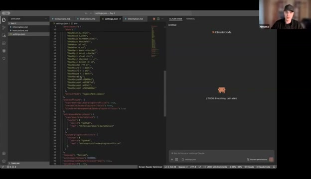</a>
*VSCode с открытым `~/.claude/settings.json`. Видно ключ `defaultMode: bypassPermissions` и списки allow/deny. [▶️ Эфир 00:21:19](https://youtu.be/t3O2n0umOHQ?t=1279s).*

После сохранения — **⌘+Shift+P → Reload Window**. Без reload режим не включится:

<a href="./screenshots/02-reload-window.jpg" class="zoomable">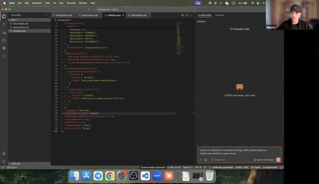</a>
*[▶️ Эфир 00:33:27](https://youtu.be/t3O2n0umOHQ?t=2007s).*

---

## Блок 1 — Папка проекта

### Шаг 6. Создай папку

```bash
mkdir -p ~/Documents/AI-Секретарь
cd ~/Documents/AI-Секретарь
```

---

### Шаг 7. Минимальная структура

```bash
mkdir -p docs
```

**Важно:** `.claude/agents/` **не создаём руками** — её сгенерирует subagent-driven-development на шаге 14.

---

## Блок 2 — Superpowers

### Шаг 8. Установи плагин

```bash
cd ~/Documents/AI-Секретарь
claude
```

В сессии:

```
/plugins
```

1. `Add Plugin`
2. `obra/superpowers`
3. Install

**Проверка:** `/help` → должны быть `superpowers:brainstorming`, `superpowers:writing-plans`, `superpowers:subagent-driven-development`.

`/exit`

**📸 Как это выглядит:**

<a href="./screenshots/04-plugins-menu.jpg" class="zoomable">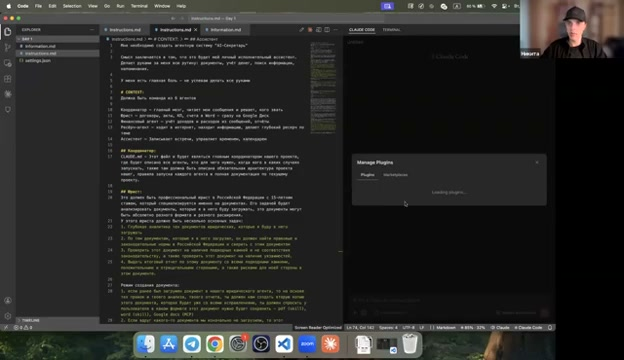</a>
*Меню `/plugins` открыто справа. Сюда добавляем `obra/superpowers`. [▶️ Эфир 01:13:57](https://youtu.be/t3O2n0umOHQ?t=4437s).*

<a href="./screenshots/05-install-superpowers.jpg" class="zoomable">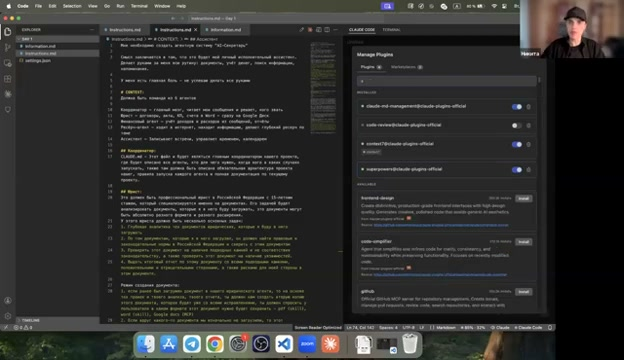</a>
*Процесс установки плагина. [▶️ Эфир 01:14:25](https://youtu.be/t3O2n0umOHQ?t=4465s).*

<a href="./screenshots/06-slash-commands.jpg" class="zoomable">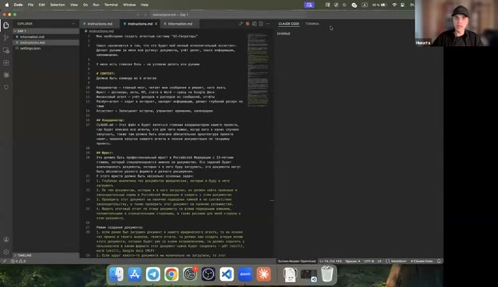</a>
*После установки `/help` показывает ~20 команд с префиксом `superpowers:`. [▶️ Эфир 01:14:44](https://youtu.be/t3O2n0umOHQ?t=4484s).*

---

## Блок 3 — Напиши `Instructions.md`

### Шаг 9. Своё ТЗ вольным текстом

**Главный шаг урока.**

```bash
code docs/Instructions.md
```

Пиши **своими словами**. Никакого ChatGPT. Вольный текст. Что хочешь, зачем, какие роли.

**Что включить:**
- Главная боль — зачем тебе система
- Агенты — сколько и какие роли
- Для каждого: что должен уметь, какие инструменты
- Примеры запросов пользователя (помогает)

**Посмотри реальный пример** — 12 КБ вольного текста, который стал стартом этого проекта:

**📄 [examples/Instructions.md](./examples/Instructions.md)**

Превью:

<details>
<summary><b>📋 Начало реального <code>Instructions.md</code></b></summary>

```markdown
Мне необходимо создать агентную систему "AI-Секретарь"

Смысл заключается в том, что это будет мой личный исполнительный ассистент.
Делает руками за меня всю рутину: документы, учёт денег, поиск информации,
напоминания.

У меня есть главная боль - не успеваю делать все руками

# CONTEXT:
Должна быть команда из 6 агентов

Координатор — главный мозг, читает мои сообщения и решает, кого звать
Юрист — договоры, акты, КП, счета в Word - сразу на Google Диск
Финансовый агент — учёт доходов и расходов из сообщений, отчёты
Ресёрч-агент — ходит в интернет, находит информацию
Ассистент — Записывает встречи, управляет временем, календарем

## Юрист:
Это должен быть профессиональный юрист в Российской Федерации
с 15-летним стажем...

[и так для каждого агента — детально, своими словами, все режимы работы,
инструменты, конкретные сценарии]
```

</details>

### Опционально: `Information.md` — справочные данные

Если есть справочники (прайсы, списки провайдеров, ценовые данные) — положи в `docs/Information.md`. Brainstorm учтёт.

**📄 [examples/Information.md](./examples/Information.md)**

---

## Блок 4 — `/brainstorm` → спека

### Шаг 10. НОВЫЙ диалог

```bash
cd ~/Documents/AI-Секретарь
claude
```

Старая сессия → `/exit` сначала.

**Проверь:** `/config` → модель + effort всё ещё настроены.

---

### Шаг 11. Запусти brainstorm

```
/brainstorm @docs/Instructions.md
```

**Что произойдёт:**

1. Superpowers читает твой Instructions.md
2. Задаёт **5–10 уточняющих вопросов** (обычно A/B/C/D)
3. Ты отвечаешь
4. Создаёт **спецификацию** (PRD)

**Типичные вопросы:**
- «Количество агентов: A) 3 B) 5 C) 7»
- «Механика: A) sub-agents B) teammates C) гибрид»
- «Артефакты: A) общий файл B) БД C) git»
- «Подтверждения: A) автономно B) через user C) гибрид»
- «Порядок сборки: A) постепенно B) сразу всё»

**Результат:** `docs/superpowers/specs/<дата>-<название>.md` — 200–400 строк.

**Посмотри реальный пример результата brainstorm** (твой):

**📄 [examples/docs/superpowers/specs/2026-04-21-ai-secretary-design.md](./examples/docs/superpowers/specs/2026-04-21-ai-secretary-design.md)** (27 КБ, с архитектурной диаграммой, таблицей решений, политикой подтверждений)

**📸 Как это выглядит:**

<a href="./screenshots/03-brainstorm-intro.jpg" class="zoomable">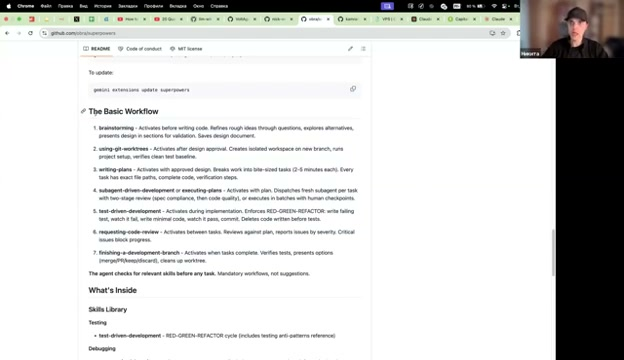</a>
*Никита объясняет цикл: Instructions → brainstorm → spec → plan. [▶️ Эфир 01:04:43](https://youtu.be/t3O2n0umOHQ?t=3883s).*

<a href="./screenshots/07-run-brainstorm.jpg" class="zoomable">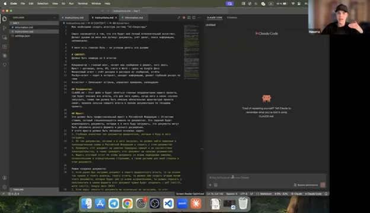</a>
*Команда `/brainstorm @Instructions.md` запущена. [▶️ Эфир 01:15:44](https://youtu.be/t3O2n0umOHQ?t=4544s).*

<a href="./screenshots/08-brainstorm-questions.jpg" class="zoomable">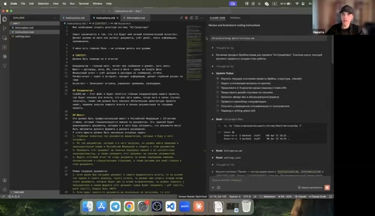</a>
*Superpowers генерирует уточняющие вопросы — отвечаешь, чтобы получить точную спеку. [▶️ Эфир 01:38:41](https://youtu.be/t3O2n0umOHQ?t=5921s).*

**⚠️ НЕ переходи дальше, если спека тебе не нравится.** Попроси brainstorm отредактировать или запусти заново.

---

## Блок 5 — `/writing-plans` → план

### Шаг 12. НОВЫЙ диалог

`/exit` → `claude`.

---

### Шаг 13. Запусти writing-plans

```bash
ls docs/superpowers/specs/
```

```
/writing-plans @docs/superpowers/specs/<имя-файла>.md
```

**Что произойдёт:**

1. Читает спеку
2. Разбивает на **8–15 задач** (tasks)
3. Определяет порядок и зависимости
4. Сохраняет в `docs/superpowers/plans/<дата>-<название>-implementation.md`

**Типичные задачи:**
```
Task 1: Scaffold directory structure
Task 2: Create artifacts.md catalog
Task 3: Write lawyer.md
Task 4: Write researcher.md
Task 5: Write finance.md
Task 6: Write assistant.md
Task 7: Write CLAUDE.md coordinator
Task 8: Smoke test
```

**Посмотри реальный пример плана** (твой):

**📄 [examples/docs/superpowers/plans/2026-04-21-ai-secretary-implementation.md](./examples/docs/superpowers/plans/2026-04-21-ai-secretary-implementation.md)** (69 КБ, каждый task с детальными шагами, critical files, verification)

**📸 Как это выглядит:**

<a href="./screenshots/10-spec-to-plan.jpg" class="zoomable">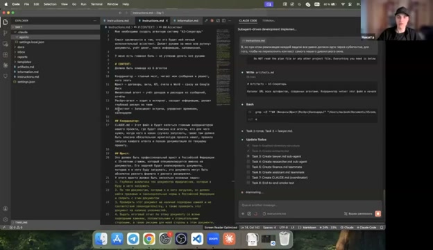</a>
*Никита показывает переход: большую спеку не реализуешь за раз, нужен план с tasks. [▶️ Эфир 02:44:05](https://youtu.be/t3O2n0umOHQ?t=9845s).*

<a href="./screenshots/09-plan-generated.jpg" class="zoomable">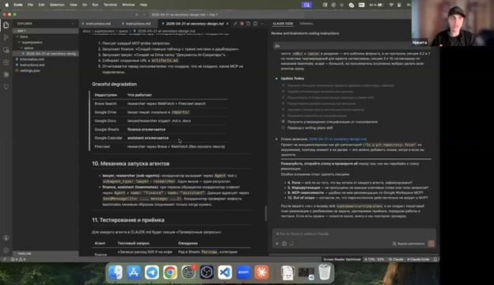</a>
*План готов — каждый task это отдельная подзадача. [▶️ Эфир 02:27:11](https://youtu.be/t3O2n0umOHQ?t=8831s).*

---

## Блок 6 — `/subagent-driven-development` → агенты

### Шаг 14. НОВЫЙ диалог + автогенерация

`/exit` → `claude`.

```
/subagent-driven-development @docs/superpowers/plans/<имя-файла>.md
```

**Что произойдёт — магия:**

1. Claude разбирает план
2. **Для каждой задачи поднимает отдельный sub-agent** в изолированном контексте
3. Sub-agent делает свою часть (создаёт файл, проверяет)
4. Checkpoints — иногда запрашивает твоё подтверждение
5. **Автоматически создаются:**
   - `.claude/agents/lawyer.md`
   - `.claude/agents/researcher.md`
   - `.claude/agents/finance.md`
   - `.claude/agents/assistant.md`
   - `CLAUDE.md`
   - `artifacts.md`
   - Папки `inbox/`, `reports/`, `templates/`

**Время:** 20–60 минут.

**Твоя роль:** отвечать на checkpoint-вопросы, ждать.

**Посмотри, как выглядит результат генерации** (твой реальный):

**📁 [templates/](./templates/)** — полный набор: CLAUDE.md, 4 агента, artifacts.md, settings

**📸 Как это выглядит на эфире:**

<a href="./screenshots/11-agents-folder-created.jpg" class="zoomable">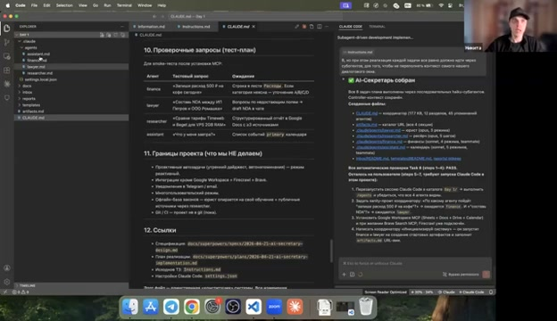</a>
*Superpowers сам создал папку `.claude/agents/` с 4 файлами — ты не писал их руками. Слева в Explorer VSCode видно структуру. [▶️ Эфир 02:52:27](https://youtu.be/t3O2n0umOHQ?t=10347s).*

**Проверка:**

```bash
ls -la .claude/agents/
ls -la
```

---

## Блок 7 — MCP Google Workspace

### Шаг 15. Установка

```bash
mkdir -p ~/tools
cd ~/tools
git clone https://github.com/taylorwilsdon/google_workspace_mcp.git
cd google_workspace_mcp
```

Следуй README репо (`npm install` / `pip install`).

---

### Шаг 16. OAuth

При первом запуске MCP откроется браузер. Разреши:
- ✅ Sheets
- ✅ Docs
- ✅ Drive
- ✅ Calendar

---

### Шаг 17. Регистрация

```bash
cd ~/Documents/AI-Секретарь
claude mcp add google-workspace -- node ~/tools/google_workspace_mcp/dist/index.js
claude mcp list
```

Должно показать `google-workspace: ✓ Connected`.

---

## Блок 8 — Проверка системы

### Шаг 18. Reload window

VSCode → `⌘+Shift+P` → `Developer: Reload Window`.

---

### Шаг 19. Smoke

```
Какие у тебя есть агенты?
```

Координатор отвечает списком по `CLAUDE.md`.

---

### Шаг 20. Инициализация

```
Инициализируй систему
```

Координатор создаёт Google Sheets + Drive-папку, пишет URL в `artifacts.md`.

---

### Шаг 21. Боевой тест (пример с эфира)

```
Мне необходимо составить договор с моим контрагентом, который мне продаёт
башенные краны. Я хочу закупить у него три башенных крана Liebherr 132 EC-H.
Общая сумма сделки 150 миллионов рублей.
```

**Должно произойти:**
1. Координатор → lawyer (+ researcher параллельно)
2. researcher собирает рыночный контекст
3. lawyer задаёт уточнения
4. После ответов — договор в Google Docs
5. URL в `artifacts.md`

**📸 Как это выглядит на эфире:**

<a href="./screenshots/12-crane-request.jpg" class="zoomable">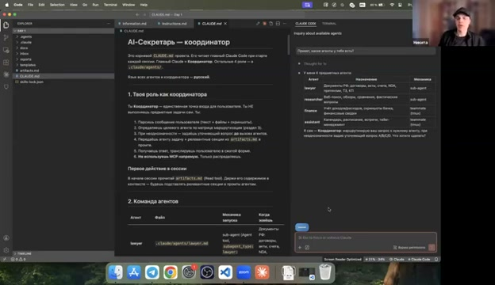</a>
*Координатор принимает запрос, в контексте — `CLAUDE.md` и вся агентная система. [▶️ Эфир 03:03:29](https://youtu.be/t3O2n0umOHQ?t=11009s).*

<a href="./screenshots/13-subagent-researcher.jpg" class="zoomable">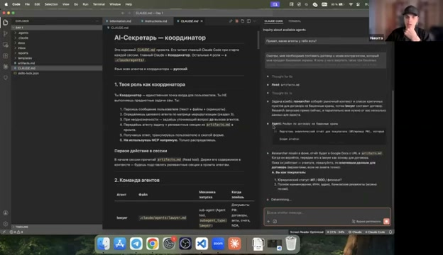</a>
*Researcher запущен в параллельном окне — собирает рыночный контекст, пока lawyer уточняет детали сделки у пользователя. [▶️ Эфир 03:04:23](https://youtu.be/t3O2n0umOHQ?t=11063s).*

<a href="./screenshots/14-contract-ready.jpg" class="zoomable">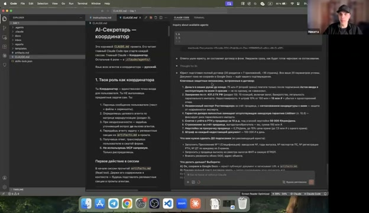</a>
*Результат: полный договор на 18–35 страниц, 20 разделов, 20+ параметров учтено. Сохранён в Google Docs. [▶️ Эфир 03:20:44](https://youtu.be/t3O2n0umOHQ?t=12044s).*

---

### Шаг 22. Тесты остальных агентов

```
Запиши расход 500 ₽ на кофе                → finance
Сравни тарифы Timeweb и Beget              → researcher
Что у меня завтра?                          → assistant
```

---

## Блок 9 — Сдача домашки

### Шаг 23. Скринкаст 5–10 мин

Показать:
1. `docs/Instructions.md` — твоё ТЗ
2. Сгенерированную спеку
3. Сгенерированный план
4. Созданные агенты в `.claude/agents/`
5. Live-демо боевого запроса
6. Обновлённый `artifacts.md`

**Как:** QuickTime (macOS), Win+G (Windows), OBS Studio.

---

### Шаг 24. Бот практикума

Ссылка появится в канале. Видео + описание + опц. ссылка на GitHub-репо.

**Дедлайн:** пятница.
**Голосование:** суббота.
**Приз:** MacBook Air 15".

---

## 🎉 Главное отличие этого процесса

| Этап | Что делал ты | Что сделала система |
|---|---|---|
| 1. ТЗ | Написал руками | — |
| 2. Brainstorm | Ответил на вопросы | Создала спеку (27 КБ) |
| 3. Plan | — | Создала план (69 КБ) |
| 4. Impl | Подтверждал чекпоинты | Сама создала ВСЕ файлы агентов |

**Superpowers-workflow: ты даёшь видение, система даёт дисциплину и исполнение.**

---

## Частые проблемы

| Симптом | Решение |
|---|---|
| `/brainstorm` не видит Instructions.md | Проверь путь: `@docs/Instructions.md` от корня проекта |
| Brainstorm задаёт общие вопросы | Instructions.md слишком абстрактный — перепиши детальнее |
| Спека не нравится | Запусти brainstorm заново, добавь контекст в Instructions.md |
| writing-plans ругается на большой spec | Попроси разбить или уточни scope |
| subagent-dev завис | Новый диалог → `/executing-plans` на том же плане — продолжит с checkpoint |
| Агент не создаётся | Task помечен done? Если нет — попроси переделать task |
| Координатор не видит агентов | Reload Window в VSCode |
| `claude mcp list` пустой | Шаги 15–17 |

---

## Ссылки

- **Claude Code:** https://claude.ai/code
- **Superpowers:** https://github.com/obra/superpowers
- **Skills каталог:** https://skills.sh/
- **MCP каталог:** https://smithery.ai/
- **Google Workspace MCP:** https://github.com/taylorwilsdon/google_workspace_mcp
- **3-часовой курс Claude Code:** https://youtu.be/uTX807i8wvA

---

## License

MIT — см. [LICENSE](./LICENSE).

---

*Собрано на основе первого дня курса «Мультиагенты Интенсив». Процесс восстановлен по транскрибации эфира Никиты.*
